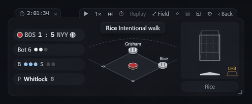
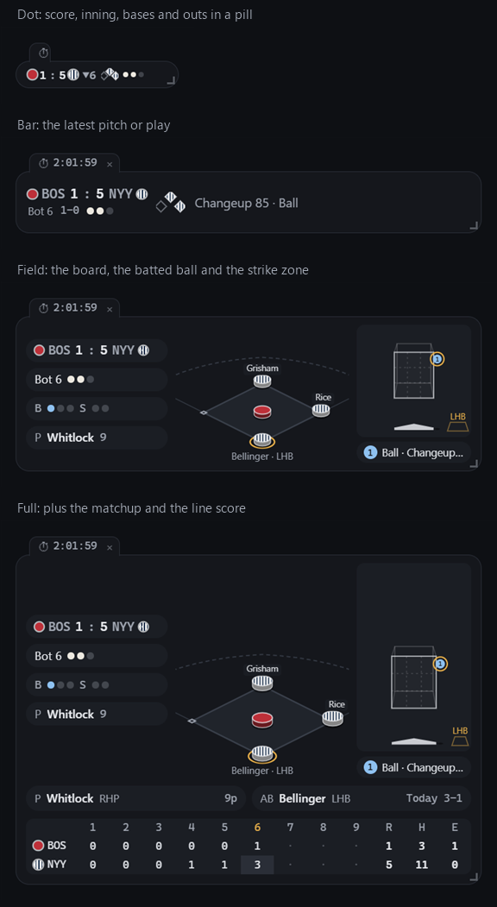

# Basesmall

**Baseball, but small.**

A tiny, quiet desktop view of the game you can't watch.

Basesmall is an unofficial desktop companion for following live MLB games. It sits in a corner of your screen and keeps your team's game going as a few abstract pieces: who is on base, the count, the outs, the score, where each pitch crossed the plate, and which way the ball went. Enough to know what is happening at a glance, without video, without sound unless you want it, and without looking like you are watching sports.



*A replay of the 2026 AL Wild Card Series, Game 2: Boston walks Rice to face Bellinger, who hits a three-run home run.*

> **Status: first release (v0.1).** Windows is the main platform. macOS and Linux builds are experimental: they are built automatically but nobody has tested them on a real machine yet.

## Download

From the [latest release](https://github.com/Zaious/basesmall/releases/latest):

| | File | Notes |
| --- | --- | --- |
| Windows, installer | `Basesmall_x.y.z_x64-setup.exe` | Installs for your user only: no administrator rights. |
| Windows, portable | `Basesmall_x.y.z_x64_portable.zip` | Nothing to install. Unzip anywhere and run `Basesmall.exe`. For PCs where installing is locked. |
| macOS (experimental) | `Basesmall_x.y.z_universal.dmg` | Unsigned: right-click the app and choose Open the first time. |
| Linux (experimental) | `.AppImage` or `.deb` | Make the AppImage executable, then run it. |

**"Windows protected your PC"?** Basesmall is not code-signed yet, so Windows does not recognise it. Click **More info**, then **Run anyway**. For a downloaded portable copy you can also right-click `Basesmall.exe`, open **Properties** and tick **Unblock**.

Basesmall needs the Microsoft Edge WebView2 Runtime, which Windows 11 includes and most Windows 10 PCs already have. If your workplace blocks unsigned programs entirely, neither version will run there.

## What it does



- **Follows your team.** Choose a team once. If it is playing, Basesmall follows the game; if not, it counts down to the next one and names the probable starters. When the season is over it asks once what you want instead: the most tense game each day, a team to adopt for the postseason, your own pick, or rest until opening day.
- **Resizes from a pill to a panel.** The smallest size is the score, the inning, three diamonds for the bases and the outs. Larger sizes add the board with team-coloured pieces and runners' names, the flight of the ball, the strike zone with every pitch numbered, the matchup and the line score. Drag the corner or press **⤢**.
- **Solid, translucent or transparent background.** Text always sits on small capsules, so it stays readable on any wallpaper.
- **Swappable styles.** Flat and 2.5D are built in. Every style is a file, and new ones are welcome ([styles/](styles/)).
- **Notices, if you want them.** A card in the corner or a ticker along an edge of the screen for the plays you choose. They never take focus from what you are typing in.
- **Scoreboard and postseason.** A drawer with every game today, the tensest first; series and game numbers in the postseason; a quiet tab when another game reaches a big moment.
- **Low-key mode.** A plain strip of numbers that does not look like sports. No notices, no sound.
- **Replays** of games from the 2023 season onward, at a compact pace that keeps the pitch-to-pitch rhythm. Joined a game late? Catch up from the first inning with results only, then carry on live.
- **Sound, off by default.** Short synthesized sounds for hits and home runs, and a quieter set for strikes, full counts, bunts and strikeouts.
- **Optional windows** from the prototype: strike zone, bases, matchup, line score, each on its own.
- **English and Traditional Chinese.**

## Using it

In a game, hover over the window for the controls: **⤢** size, **◇** style, **▤** scoreboard, **◱** low-key mode, **⏩** catch up, **⚙** settings, **‹** back to the game list. The tray icon has the same and more: show or hide, click-through, always on top, background.

| Key | Does |
| --- | --- |
| Ctrl+Alt+Shift+B | Hide or show every Basesmall window |
| Ctrl+Alt+Shift+L | Low-key mode on or off |

Both can be changed or switched off in settings. Settings live in `settings.json` in the app's config folder (on Windows `%APPDATA%\io.github.zaious.basesmall\`). Custom styles go in its `styles` folder.

## Privacy

Basesmall runs entirely on your computer. No account, no server, no analytics. It talks to two places:

- `statsapi.mlb.com`, for game data, from your own computer.
- `api.github.com`, once per session and only when you open Settings, to tell you whether a newer version exists. Nothing is downloaded or installed by itself.

## Roadmap

- [x] **M0** Data probe: endpoints, fields and update rates measured against real responses ([report, in Chinese](docs/PROBE_REPORT.md))
- [x] **M1** Normalized game model and replay, checked against MLB's own totals.
- [~] **M2** Floating window and live data: working on Windows; live latency measurement pending
- [x] **M3** The board: styles, team colours, size tiers, animation. A 12-inning game replayed with every step's board checked against the official state: no mismatches.
- [x] **M4** Sound, settings and notifications.
- [x] **M5** Following your team, scoreboard, postseason, low-key mode, hotkeys, optional windows, catch-up, extra sounds.
- [x] **M6** Releases: Windows installer and portable zip, experimental macOS and Linux builds, licences, guides for contributors.

Technical documents are in Traditional Chinese: [architecture](docs/ARCHITECTURE.md), [data source and terms](docs/DATA_SOURCE.md), [data probe report](docs/PROBE_REPORT.md).

## Building from source

Requires Node 24 and Rust (on Windows also the MSVC build tools).

```bash
npm install
npm run tauri build -- --no-bundle    # the app: src-tauri/target/release/basesmall(.exe)
```

That is all a fresh machine needs; it is what the [CI](.github/workflows/ci.yml) does on a clean Windows runner for every push. For development:

```bash
npm run tauri dev                     # the floating window with live reload
npm test                              # tests; with recorded games, many more run (below)
npm run typecheck
node scripts/probe/07-fixtures.mjs   # record a few finished games into fixtures/mlb/ (git-ignored)
```

Installers as released, with the third-party licences inside: `node scripts/third-party-licenses.mjs`, then `npm run tauri build -- --config src-tauri/tauri.release.conf.json`.

Open a game directly: `basesmall --game=<gamePk>` follows it live, `--mode=replay` replays a finished one.

## Contributing

Team colours that look wrong, styles, bug reports and code are all welcome: see [CONTRIBUTING.md](CONTRIBUTING.md). It also explains how to add another league.

## Data, trademarks and disclaimers

- Basesmall is an independent fan project. It is **not affiliated with, endorsed by, or sponsored by** Major League Baseball, MLB Advanced Media, the MLB Players Association, or any team.
- Game data comes from the MLB Stats API and is fetched directly by your own computer. It is subject to MLB Advanced Media's [copyright notice](http://gdx.mlb.com/components/copyright.txt), which permits individual, non-commercial, non-bulk use. Basesmall does not host, relay or redistribute MLB data. The repository holds no MLB data apart from the two pictures in `docs/media`, which show one game as the app displays it.
- No team logos, wordmarks, numbers or league marks are used. Teams are shown by name, abbreviation, colour and, for a few teams, a simple pattern such as pinstripes. Team colour values come from [colorr](https://github.com/lobsterbush/colorr) (MIT); see [NOTICE](styles/team-colors/NOTICE.md).
- Basesmall is free and will stay free: no ads and no paid features.

## Support

Basesmall is free and stays free. If it keeps you company at work, you can [buy me a coffee](https://buymeacoffee.com/zaious).

## License

[MIT](LICENSE), for the code in this repository. MLB data is not covered. Releases include `THIRD_PARTY_LICENSES.txt` with the licences of everything compiled into the app.
